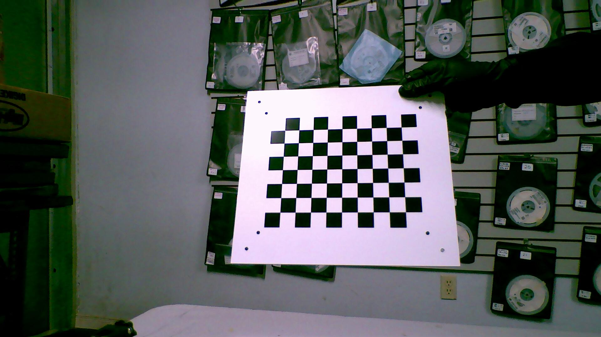
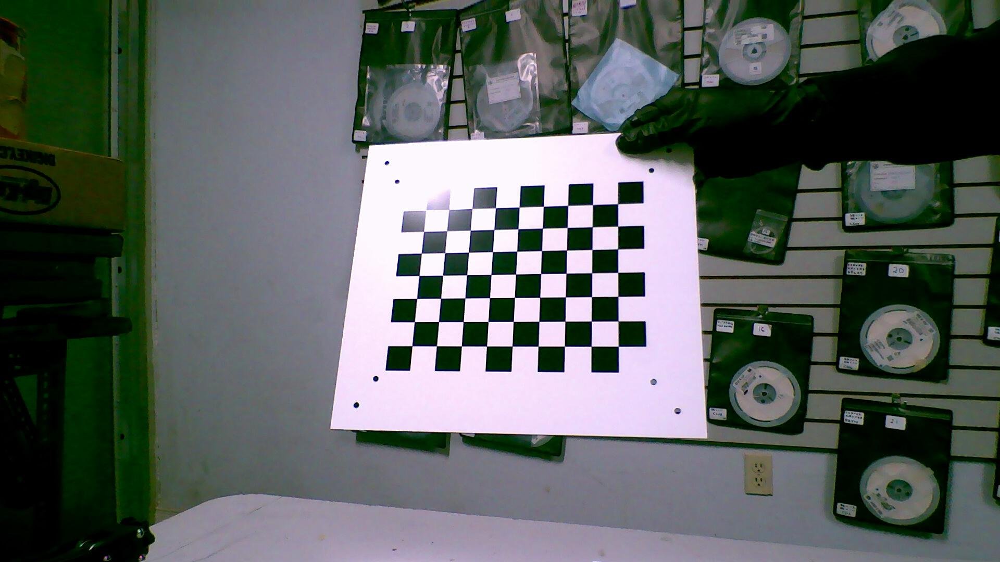
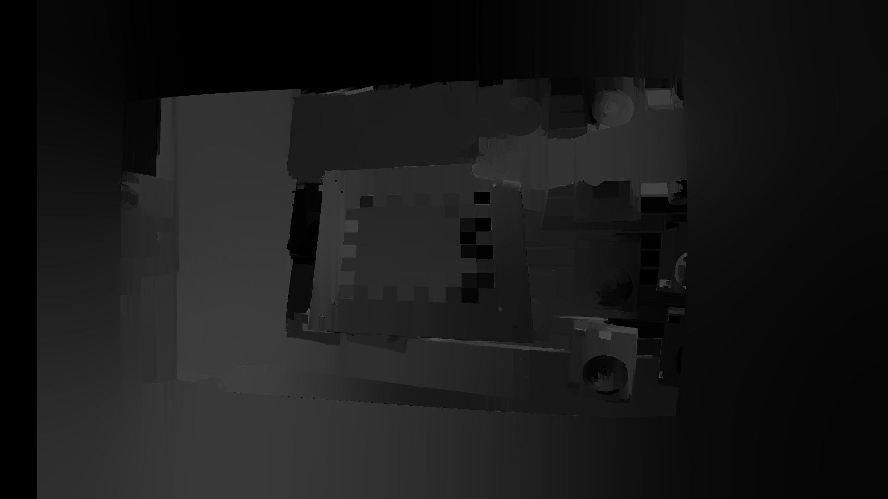

## Status:

# so the results for depth:

C++ version is predicting with using deep ssim and evan's triangulation
python one is old method 
Both are working version

Next step is substitute the ssim algo.

export LD_LIBRARY_PATH=/content/condaenv/lib:/usr/local/nvidia/lib:/usr/local/nvidia/lib64

for C++ version,
current only works with opencv4.8.1 now
so need to compile opencv 4.8.1 at this two:
opencv:/home/myd/Desktop/Stereo-reconstruct-C++/tflite/pose_stereovision/build
opencv_contrib:/home/myd/Desktop/Stereo-reconstruct-C++/tflite/pose_stereovision/build

switch opencv4.8.1 to opencv4.7.0

git clone https://github.com/opencv/opencv.git

cd opencv

git checkout 4.8.1

cd ..

git clone https://github.com/opencv/opencv_contrib.git

cd opencv_contrib

git checkout 4.8.1

cd ..

cd opencv

mkdir build && cd build

substitue the opencv and opencv-contrib

delete cmake cache and cmae files

then

cmake -D CMAKE_BUILD_TYPE=RELEASE       -D CMAKE_INSTALL_PREFIX=/usr/local       -D OPENCV_EXTRA_MODULES_PATH=../../opencv_contrib/modules       -D WITH_CUDA=OFF       -D BUILD_TESTS=OFF       -D INSTALL_PYTHON_EXAMPLES=OFF       -D BUILD_EXAMPLES=OFF ..

make -j$(nproc)

sudo make install

sudo ldconfig

